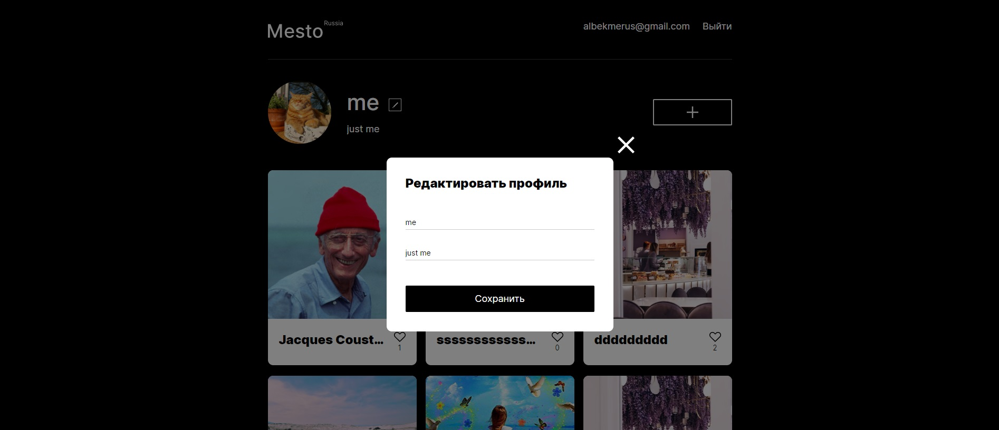

# Project: Mesto 
## About the project:
The interactive service that allows users to sign up, sign in, add photos and captions to them, delete added photos, put likes, edit profile information, change the user's avatar.


*At the moment the following options are available:*
- receiving user data and initial cards from server,
- opening popups,
- closing popups by click,
- editing profile information,
- adding new photo and its caption,
- activating the "like" button,
- deleting photos ,
- changing user's avatar,
- "like" counter,
- registration of user,
- authorization of user.


[Project link on GitHub Pages](https://alinazolotavina.github.io/react-mesto-auth/npm run deploy)
## Technologies in use:
- HTML5: semantic markup;
- CSS3: Flexible Box Layout, Grid Layout, Backgrounds and Borders,  Colors, Fonts, Media queries;
- Java Script: OOP, HTTP request methods, Promise.
- React JS: function components, hooks (useState, useEffect, useRef, useContext), CurrentUserContext, react-router-dom.

## Deployment Instructions:
```
git clone https://github.com/AlinaZolotavina/react-mesto-auth.git
npm install
npm start
```

## Future scope:
- Client-side form validation

# Проект: Место 
## О проекте:
Интерактивный сервис, позволяющий пользователям регистрироваться, авторизовываться, добавлять фотографии и подписи к ним, удалять добавленные фотографии, ставить лайки, редактировать информацию профиля, изменять аватар пользователя.

*На данный момент доступны следующие возможности:*
- получение данных пользователя и исходных карточек с сервера,
- открытие попапов,
- закрытие попапов по клику,
- редактирование информации профиля,
- добавление новой фотографии с подписью к ней,
- активация кнопки "лайка",
- удаление фотографий,
- изменение аватара пользователя,
- счетчик "лайков",
- регистрация пользователя,
- авторизация пользователя.

[Ссылка на проект на GitHub Pages](https://alinazolotavina.github.io/react-mesto-auth/)
## Использованные технологии:
- HTML: семантическая верстка;
- CSS: технология построения сетки Flex, технология построения сетки Grid Layout, фоны и границы, цвета, шрифты, медиазапросы;
- Java Script: ООП, HTTP-запросы, промисы;
- React JS: функциональные компоненты, хуки (useState, useEffect, useRef, useContext), CurrentUserContext, react-router-dom.

## Инструкция по развертыванию проекта:
```
git clone https://github.com/AlinaZolotavina/react-mesto-auth.git
npm install
npm start
```

## Планы по доработке проекта:
- Валидация форм на стороне пользователя.